# 💳 Stripe-Like Subscription Management System


A high-fidelity, full-stack subscription management platform designed with a "Stripe-like" aesthetic and robust backend architecture. This project demonstrates a production-ready implementation of complex subscription logic, including idempotency, capacity management, and real-time status updates, wrapped in a premium, highly responsive user interface.

## 🏗️ Architecture

The system follows a modern tailored **Client-Server Architecture**, decoupling the high-performance React frontend from the robust Node.js/PostgreSQL backend.

```mermaid
graph TD
    Client["📱 React Client (Vite)"]
    API["🛡️ Express API Gateway"]
    DB[("🗄️ PostgreSQL Database")]

    subgraph "Frontend Layer"
        Client -->|REST / Axios| API
        Client -.->|Glassmorphism UI| CSS["StripeLanding.css"]
    end

    subgraph "Backend Layer"
        API -->|Auth Middleware| Routes
        Routes -->|Business Logic| Controllers
        Controllers -->|SQL Transaction| DB
    end

    subgraph "Data Persistence"
        DB -->|ACID Compliance| Tables["Customers, Plans, Subscriptions"]
    end
```



## 🚀 Key Features

### 🎨 Premium UI/UX (Pixel-Perfect)
-   **Stripe-Inspired Landing Page**: Features a custom-built spotlight effect, smooth parallax scrolling, and glassmorphism cards (`StripeLanding.jsx`).
-   **Interactive Checkout Demo**: A static, high-fidelity reproduction of a checkout widget utilizing CSS gradients and overlapping layouts for a professional look.
-   **Modern Dashboard**: A clean, card-based interface for managing active and inactive subscriptions.

### ⚙️ Robust Subscription Engine
-   **Plan Management**: Create, edit, and deactivate subscription tiers. Includes capacity tracking (e.g., "Only 5 spots left").
-   **Lifecycle Management**: Full support for purchasing, expiring, and cancelling subscriptions.
-   **Idempotency**: Prevents double-billing by implementing idempotency keys for all transaction-critical operations.
-   **Concurrency Control**: Uses SQL `FOR UPDATE` and atomic transactions to allow safe concurrent purchases without over-selling plan capacity.

## 🛠️ Tech Stack

### Frontend
-   **Framework**: React 19 + Vite (Fast HMR & build).
-   **Styling**: Vanilla CSS with CSS Variables (No frameworks, pure custom design for maximum control).
-   **State Management**: React Hooks (`useState`, `useEffect`, `Context`).
-   **HTTP Client**: Axios with global interceptors for auth and error handling.

### Backend
-   **Runtime**: Node.js.
-   **Framework**: Express.js.
-   **Database**: PostgreSQL.
-   **Authentication**: JWT (JSON Web Tokens) + bcryptjs.
-   **Security**: Helmet.js, CORS configuration.

## 📦 Installation & Setup

### Prerequisites
-   Node.js (v16+)
-   PostgreSQL (v13+)

### 1. Database Setup
Create a PostgreSQL database and execute the schema.
```sql
CREATE DATABASE subscription_db;
-- Import schema found in backend/src/db/schema.sql (if available) or construct tables:
-- customers, plans, subscriptions, users
```

### 2. Backend Configuration
Navigate to the backend directory and set up environment variables.
```bash
cd backend
cp .env.example .env
npm install
```
*Ensure your `.env` contains `DB_HOST`, `DB_USER`, `DB_PASS`, `DB_NAME`, and `JWT_SECRET`.*

Run the server:
```bash
npm run dev
# Server runs on http://localhost:3000
```

### 3. Frontend Setup
Navigate to the frontend directory.
```bash
cd ../frontend
npm install
npm run dev
# App runs on http://localhost:5173
```

## 🔧 Troubleshooting & Common Issues

Having trouble running the project locally? Check these common solutions.

### 1. Database Connection Refused
**Error**: `connection to server at "localhost" (::1), port 5432 failed: Connection refused`
-   **Cause**: PostgreSQL is not running or the port is blocked.
-   **Fix**:
    -   Ensure the Postgres service is active: `sudo service postgresql start` or via your OS service manager.
    -   Verify details in `backend/.env` match your local DB credentials.

### 2. "Relation does not exist"
**Error**: `error: relation "users" does not exist`
-   **Cause**: The database tables haven't been created yet.
-   **Fix**: Check `backend/src/db/schema.sql` (if provided) or manually create the required tables (`customers`, `plans`, `subscriptions`, `users`) in your database.

### 3. Port Already in Use
**Error**: `EADDRINUSE: address already in use :::3000`
-   **Cause**: Another instance of the backend is already running.
-   **Fix**:
    -   Kill the process: `npx kill-port 3000`
    -   Or change `PORT` in `.env` and restart.

### 4. White Screen / 404 in Frontend
-   **Cause**: The API call is failing or the backend isn't running.
-   **Fix**:
    -   Check the browser console (F12) for Network errors.
    -   Ensure `VITE_API_BASE_URL` in `frontend/.env` points to your running backend (e.g., `http://localhost:3000/api`).

### 5. Authentication Fails (JWT Error)
-   **Cause**: Missing or mismatched `JWT_SECRET`.
-   **Fix**: Ensure `JWT_SECRET` is set in `backend/.env` and is a secure random string. Restart the server after changing it.

---

## 🧠 Implementation Details

### **1. Idempotency & Concurrency**
One of the most critical aspects of this system is preventing race conditions during plan purchases.
**Logic**:
-   When a user attempts to purchase a limited-capacity plan, we start a SQL transaction (`BEGIN`).
-   We lock the plan row (`SELECT ... FOR UPDATE`) to prevent other transactions from modifying the capacity simultaneously.
-   We check for existing `idempotency_key` to ensuring retried requests don't result in duplicate charges.
-   Only then do we decrement capacity and insert the subscription (`COMMIT`).

### **2. Premium Styling Architecture**
Instead of using generic UI libraries, we implemented a custom design system in `StripeLanding.css` and `PlansList.css`:
-   **Variables**: Global color tokens (`--primary`, `--surface`) ensure consistency.
-   **Glassmorphism**: Heavy use of `backdrop-filter: blur()` and semi-transparent backgrounds.
-   **Performance**: CSS animations (Floating cards, Spotlights) are hardware-accelerated using `transform: translate3d()` to ensure 60fps performance.

## 📚 API Reference

| Method | Endpoint | Description |
| :--- | :--- | :--- |
| `GET` | `/api/plans` | List all available subscription plans. |
| `POST` | `/api/subscriptions` | Purchase a new subscription (Requires Auth). |
| `DELETE` | `/api/subscriptions/:id` | Cancel/Deactivate a subscription. |
| `GET` | `/api/customers` | Fetch customer profiles and history. |

---

*Built with ❤️ for advanced subscription management.*
